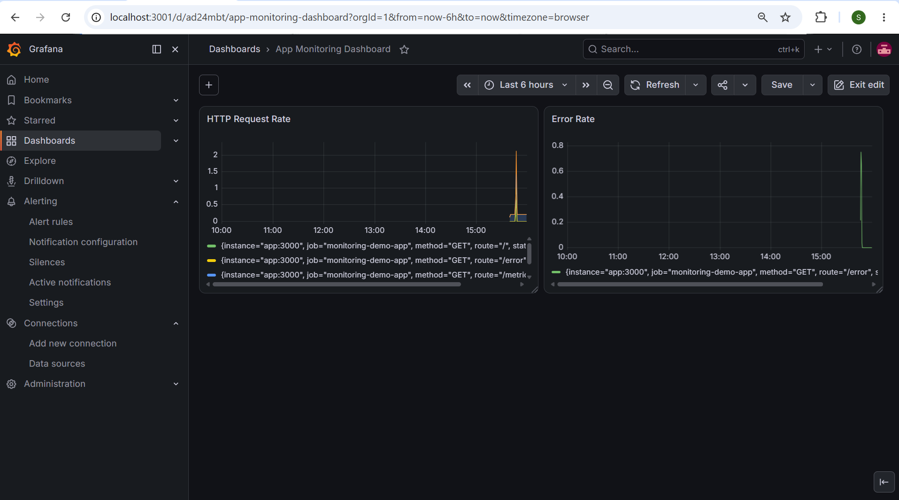

# 📊 Monitoring Stack with Prometheus & Grafana

## 📌 About

A complete application monitoring setup demonstrating real-world observability practices — a Node.js app instrumented with custom Prometheus metrics, scraped by Prometheus, and visualized in Grafana dashboards with alerting. Fully orchestrated with Docker Compose (3 containers, one command to run).

## 🛠️ Tech Stack

- **App:** Node.js, Express, prom-client
- **Metrics Collection:** Prometheus
- **Visualization & Alerting:** Grafana
- **Orchestration:** Docker Compose

## 🏗️ Architecture

    App (Node.js)
        |
        +-- Exposes /metrics endpoint (Prometheus format)
        |
        v
    Prometheus
        |
        +-- Scrapes /metrics every 5s
        +-- Stores time-series data
        |
        v
    Grafana
        |
        +-- Queries Prometheus as data source (auto-provisioned)
        +-- Dashboards: HTTP Request Rate, Error Rate
        +-- Alert rule: High Request Rate (threshold-based)

    All 3 services run in a shared Docker network via docker-compose.yml

## 🚀 How to Run

    git clone https://github.com/shashanksk04/monitoring-prometheus-grafana.git
    cd monitoring-prometheus-grafana

    docker compose up -d

This starts all 3 services:

| Service     | URL                          | Credentials      |
|-------------|-------------------------------|-------------------|
| App         | http://localhost:3000         | -                 |
| Prometheus  | http://localhost:9090         | -                 |
| Grafana     | http://localhost:3001         | admin / admin     |

Prometheus data source is auto-configured in Grafana — no manual setup needed.

To stop everything:

    docker compose down

## 📡 App Endpoints

| Method | Endpoint   | Description                          |
|--------|------------|----------------------------------------|
| GET    | `/`        | Health check                           |
| GET    | `/work`    | Simulates variable-latency work        |
| GET    | `/error`   | Simulates a 500 error (for testing)    |
| GET    | `/metrics` | Prometheus-format metrics endpoint     |

## 📸 Dashboard

*Live dashboard showing HTTP request rate (by route) and error rate, scraped from the app's `/metrics` endpoint every 5 seconds.*

## 🔔 Alerting

A Grafana alert rule (`High Request Rate Alert`) is configured to trigger when the request rate exceeds 5 req/sec, evaluated every 10 seconds with a 1-minute pending period — demonstrating threshold-based alerting on live metrics.

## ✅ What This Project Demonstrates

- Instrumenting an application with custom Prometheus metrics (`prom-client`)
- Configuring Prometheus to scrape metrics on a schedule
- Multi-container orchestration with Docker Compose (app + Prometheus + Grafana)
- Configuration-as-code: auto-provisioning Grafana data sources (no manual UI setup)
- Building dashboards with real-time time-series queries (PromQL)
- Setting up threshold-based alerting on live application metrics

## 👤 Author

**Shashank**
[GitHub](https://github.com/shashanksk04)

## 🔴 Try It Live

This project isn't hosted permanently (monitoring stacks are typically run on-demand, not left running 24/7). To see it live:

    git clone https://github.com/shashanksk04/monitoring-prometheus-grafana.git
    cd monitoring-prometheus-grafana
    docker compose up -d

All 3 services will be running within seconds — no rebuild needed. Happy to walk through it live on a call.

